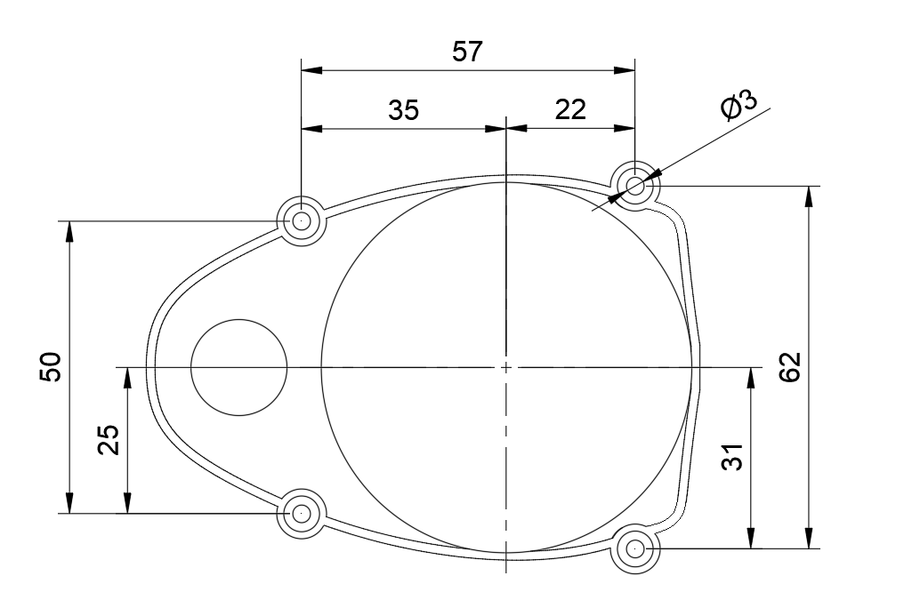

# camsense-X1
unofficial reverse engineering of a Chinese LiDAR. 

Discussed this on my discord: https://discord.gg/zRGJcqa

ROS1 driver for the camsense-X1: https://github.com/Vidicon/camsense_driver Made by [Vidicon](https://github.com/vidicon) (Bram Fenijn) <br>
ROS2 driver for the camsense-X1: https://github.com/rossihwang/ros2_camsense_x1 Made by [rossihwang](https://github.com/rossihwang)

implementation for a STM32: https://github.com/anhui1995/Camsense_X1

Read the LiDAR with a M5Stack: https://github.com/yishii/LiDAR_Camsense_X1_M5Stack Made by [yishii](https://github.com/yishii) 

*Your opensource camsense-X1 project here? Please let me know.*  


## Dimensions

The dimensions(mm) of the Camsense-x1 mounting holes:


I have made a 3d model of the LiDAR: [stl](Camsense_X1.stl), [step](camsense_x1.step)  (Dimensions are approximate)

## Electrical Connections
There are 3 pins needed to connect to the lidar: 5V, GND and TX. For this you can use the mounted connector(part number unknown) or solder some pinheader to the pcb.

The tx pin sends serial data with 115200 baud at a signal level of 3.3v This make the lidar safe to be connected directly to a 3.3v microcontroller of SBC like the STM32 or Raspberry Pi 

A FTDI adapter can be used to connect the LiDAR to a computer. The TX pin of the LiDAR needs to be connected to the RX pin of th FTDI adapter. The LiDAR can be powered using the 5V of the FTDI adapter. 


## Communication Protocol

The lidar sends on average 50 packages per rotation of the sensor. A package is always 36 bytes and has the following format:

<0x55><0xAA><0x03><0x08><br>
\<speedL>\<speedH><br>
\<startAngleL>\<startAngleH><br>
\<distance0L>\<distance0H>\<quality0><br>
\<distance1L>\<distance1H>\<quality1><br>
\<distance2L>\<distance2H>\<quality2><br>
\<distance3L>\<distance3H>\<quality3><br>
\<distance4L>\<distance4H>\<quality4><br>
\<distance5L>\<distance5H>\<quality5><br>
\<distance6L>\<distance6H>\<quality6><br>
\<distance7L>\<distance7H>\<quality7><br>
\<endAngleL>\<endAngleH><br>
\<unknown>\<unknown> could be a CRC<br>

A package always starts with <0x55><0xAA><0x03><0x08><br>

Calculate rotation speed in hz:
```c++
float Hz = ((uint16_t) (speedH << 8) | speedL) / 3840.0; // 3840.0 = (64 * 60)
```
Calculate start and end Angle in degrees:
```c++
 float startAngle = (startAngleH << 8 | startAngleL) / 64.0 - 640.0;
 float endAngle   = (endAngleH   << 8 | endAngleL)   / 64.0 - 640.0;
```

Best method we found to calculate index and parse data to array:
```c++
float offset_ = 16.0; // 0 degrees seems to be 16 degrees of center.
const float IndexMultiplier = 400 / 360.0;

float step = 0.0;
if(endAngle > startAngle)
{
    step = (endAngle - startAngle) / 8; 
}
else
{
    step = (endAngle - (startAngle - 360)) / 8; 
}

for(int i = 0; i < 8; i++) // for each of the 8 samples
{
    float sampleAngle = (startAngle + step * i) + (offset_ + 180);
    float sampleIndexFloat = sampleAngle * IndexMultiplier; // map 0-360 to 0-400
    int sampleIndex = round(sampleIndexFloat); // round to closest value.
    index = sampleIndex % 400; // limit sampleIndex between 0 and 399 to prevent segmentation fault
    
    uint8_t distanceL = data[8+(i*3)];
    uint8_t distanceH = data[9+(i*3)];
    uint8_t quality = data[10+(i*3)];
    
    
    if(quality == 0) // invalid data
    {
      distanceArray[index] = 0;
      qualityArray[index] = 0;
    }
    else
    {
      distanceArray[index] = ((uint16_t) distanceH << 8) | distanceL;
      qualityArray[index] = quality;
    }
}
```


