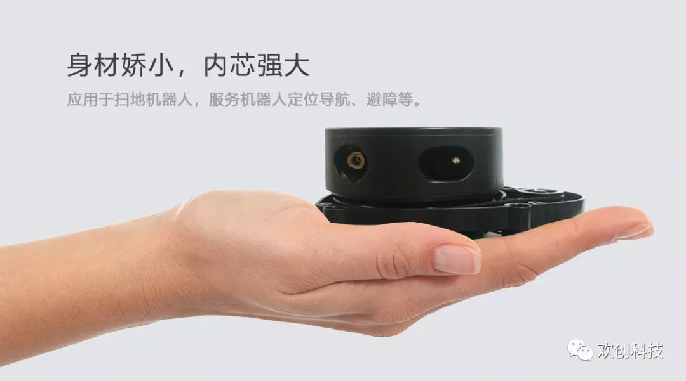
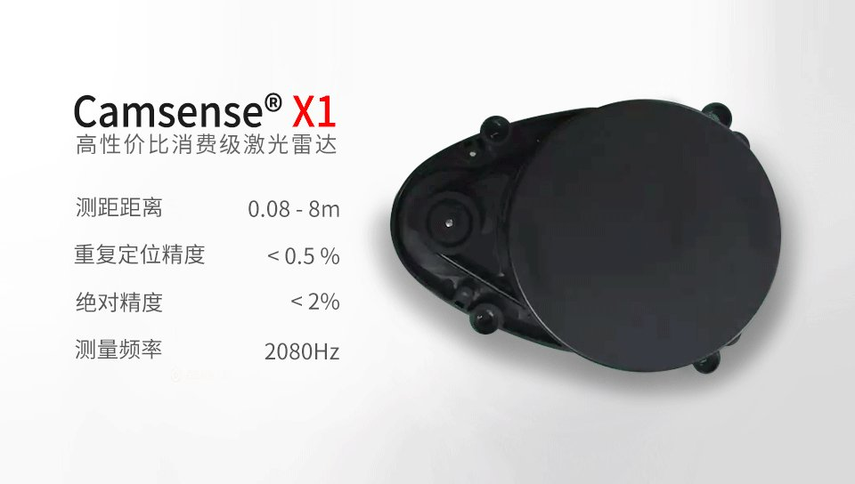

# camsense-X1
unofficial reverse engineering of a Chinese LiDAR. 

Discussed this on my discord: https://discord.gg/zRGJcqa

ROS1 driver for the camsense-X1: https://github.com/Vidicon/camsense_driver Made by [Vidicon](https://github.com/vidicon) (Bram Fenijn) <br>
ROS2 driver for the camsense-X1: https://github.com/rossihwang/ros2_camsense_x1 Made by [rossihwang](https://github.com/rossihwang)

implementation for a STM32: https://github.com/anhui1995/Camsense_X1

Read the LiDAR with a M5Stack: https://github.com/yishii/LiDAR_Camsense_X1_M5Stack Made by [yishii](https://github.com/yishii) 

*Your opensource camsense-X1 project here? Please let me know.*  





## Electrical Connections
There are 3 pins needed to connect to the lidar: 5V, GND and TX. For this you can use the mounted connector(part number unknown) or solder some pinheader to the pcb.

A FTDI adapter is used to connect the lidar to a computer. The TX pin of the lidar needs to be connected to the RX pin of th FTDI adapter. The lidar can be powered using the 5V of the FTDI adapter.


## Communication Protocol

still not fully known...

<0x55><0xAA><0x03><0x08><br>
\<speedL>\<speedH><br>
\<startAngleL>\<startAngleH><br>
\<distance0L>\<distance0H>\<quality0><br>
\<distance1L>\<distance1H>\<quality1><br>
\<distance2L>\<distance2H>\<quality2><br>
\<distance3L>\<distance3H>\<quality3><br>
\<distance4L>\<distance4H>\<quality4><br>
\<distance5L>\<distance5H>\<quality5><br>
\<distance6L>\<distance6H>\<quality6><br>
\<distance7L>\<distance7H>\<quality7><br>
\<endAngleL>\<endAngleH><br>
\<unknown>\<unknown> could be a CRC<br>

```c++
 float startAngle = (data [7] << 8 | data [6]) / 64.0 - 640.0;
```
